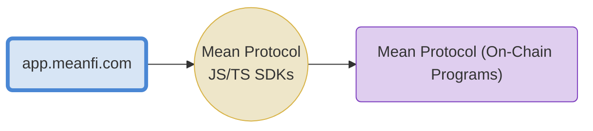

# Payment Streaming
The Payment Streaming program is one of the interoperable smart contracts composing the Mean Protocol. It is maintained by the Mean DAO and is deployed on the Solana Blockchain. 

Payment streaming represents the idea of continuous payments over time. Block numbers are used to measure time in the blockchain and continuously update the balances of the parties in the contract. Head over to the **[Whitepaper](https://docs.meandao.org/mean/products/mean-protocol/payment-streaming-whitepaper)** for more details.

The Payment Streaming program is an implementation of the protocol built and deployed on the Solana blockchain, with address `MSPCUMbLfy2MeT6geLMMzrUkv1Tx88XRApaVRdyxTuu` on [Mainnet Beta](https://explorer.solana.com/address/MSPCUMbLfy2MeT6geLMMzrUkv1Tx88XRApaVRdyxTuu).




- Payment Streaming SDK 👉 **[HERE](https://github.com/mean-dao/payment-streaming/blob/main/sdks/payment-streaming/README.md)** (how to use instructions there)
- MeanFi App 👉 **[HERE](https://meanfi.com)** 
[MeanFi](https://meanfi.com) is a web3 app you can use to interact with the different programs in the Mean Protocol 

## Program address:
 - MAINNET: `MSPCUMbLfy2MeT6geLMMzrUkv1Tx88XRApaVRdyxTuu`
 - DEVNET: `MSPdQo5ZdrPh6rU1LsvUv5nRhAnj1mj6YQEqBUq8YwZ`

## How to use the SDK (Using Anchor framework)

### Install dependency
```
yarn add @mean-dao/payment-streaming
```

### Import dependencies
```ts
import { Connection, Keypair, PublicKey } from '@solana/web3.js';
import {
  PaymentStreaming,
  PAYMENT_STREAMING_PROGRAM_ID_DEVNET,
  AccountType,
  NATIVE_SOL_MINT,
  PaymentStreamingAccount,
  Stream,
} from '../src';
...
```

### Create client instance
```ts
const rpcUrl = 'http://localhost:8899';
const connection = new Connection(rpcUrl, 'confirmed');
const psClient = new PaymentStreaming(
  connection,
  PAYMENT_STREAMING_PROGRAM_ID_DEVNET,
  'confirmed',
);
```

### Create sample data
```ts
const ownerKey = Keypair.generate();
const owner = ownerKey.publicKey;
const beneficiary1 = Keypair.generate().publicKey;
const beneficiary2 = Keypair.generate().publicKey;
console.log(`owner: ${owner}`);
console.log(`beneficiary1: ${beneficiary1}`);
console.log(`beneficiary2: ${beneficiary2}`);

// When the native SOL mint is used, the client will automatically wrap to WSOL
const mint = NATIVE_SOL_MINT;
```

### Create a payment streaming account
```ts
  const { transaction: createAccountTx, psAccount } =
    await psClient.buildCreateAccountTransaction(
      {
        owner: owner, // authority over the newly created account
        mint: mint, // mint that will be streamed out of this account
      },
      'Airdrop', // name (label for the new account)
      AccountType.Open, // type (account type)
      true, // solFeePayedFromAccount (whether SOL protocol fees will be
      // payed from the new account SOL balance or by the payer account)
    );
  // Send transaction and wait for confirmation
  createAccountTx.partialSign(ownerKey);
  const createAccountTxId = await connection.sendRawTransaction(
    createAccountTx.serialize(),
  );
  await connection.confirmTransaction({
    signature: createAccountTxId,
    blockhash,
    lastValidBlockHeight,
  });
```

### Add funds to the Payment Streaming account
```ts
  const { transaction: addFundsTx } =
    await psClient.buildAddFundsToAccountTransaction(
      {
        psAccount: psAccount,
        psAccountMint: mint,
        contributor: owner, // account authorizing the funds to be added
      }, // account paying for rent and SOL protocol fees
      500_000_000,
    );
  // Send transaction and wait for confirmation
  addFundsTx.partialSign(ownerKey);
  const addFundsTxId = await connection.sendRawTransaction(
    addFundsTx.serialize(),
  );
  await connection.confirmTransaction({
    signature: addFundsTxId,
    blockhash,
    lastValidBlockHeight,
  });
```

### Create 2 streams under the account we created before
```ts
  // create stream 1
  const { transaction: createStream1Tx, stream: stream1 } =
    await psClient.buildCreateStreamTransaction(
      {
        psAccount: psAccount,
        owner: owner, // owner of the cointaining PS account
        beneficiary: beneficiary1,
      },
      'Airdrop for Alice', // name
      1000, // rateAmount
      1, // rateIntervalInSeconds
      1_000_000, // allocationAssigned
      new Date(), // startUtc
    );

  // Send createStream1Tx and wait for confirmation
  createStream1Tx.partialSign(ownerKey);
  const createStream1TxId = await connection.sendRawTransaction(
    createStream1Tx.serialize(),
  );
  await connection.confirmTransaction({
    signature: createStream1TxId,
    blockhash,
    lastValidBlockHeight,
  });

  // create stream 2
  const { transaction: createStream2Tx } =
    await psClient.buildCreateStreamTransaction(
      {
        psAccount: psAccount,
        owner: owner, // owner of the cointaining PS account
        beneficiary: beneficiary1,
      },
      'Airdrop for Bob', // name
      1000, // rateAmount
      1, // rateIntervalInSeconds
      300_000, // allocationAssigned
      new Date(), // startUtc
    );

  // Send createStream2Tx and wait for confirmation
  createStream2Tx.partialSign(ownerKey);
  const createStream2TxId = await connection.sendRawTransaction(
    createStream2Tx.serialize(),
  );
  await connection.confirmTransaction({
    signature: createStream2TxId,
    blockhash,
    lastValidBlockHeight,
  });
```

### List Payment streaming accounts
```ts
  const accounts = await psClient.listAccounts(owner);
  console.log(accounts.map(prettifyAccount));
```
Output:
```ts
[
  {
    id: 'A6APsTFJZH7jcn3YmgRhnqUoHS9HSEUd8N59oP4zrpuy',
    name: 'Airdrop',
    autoClose: false,
    createdOnUtc: 2022-12-09T14:15:18.000Z,
    AccountType: 'Open',
    owner: 'Vb6AjHGNU9DHA98MMWNM7a8NPzFpKwZFSeAPz5ZrKt3',
    mint: 'So11111111111111111111111111111111111111112',
    balance: '500000000',
    allocationAsigned: '1300000',
    totalWithdrawals: '0',
    totalStreams: '2'
  }
]
```

### List streams
```ts
  const streams = await psClient.listStreams({
    psAccount: psAccount,
  });
  console.log(streams.map(prettifyStream));
```
Output:
```ts
[
  {
    id: '97GKbgibzSSNSPZ9pgZJ5bToep5a3nKRSFeBy3nfcVKA',
    name: 'Airdrop for Alice',
    startUtc: 'Fri Dec 09 2022 15:15:20 GMT+0100 (Central European Standard Time)',
    psAccountOwner: 'Vb6AjHGNU9DHA98MMWNM7a8NPzFpKwZFSeAPz5ZrKt3',
    psAccount: 'A6APsTFJZH7jcn3YmgRhnqUoHS9HSEUd8N59oP4zrpuy',
    beneficiary: 'A6APsTFJZH7jcn3YmgRhnqUoHS9HSEUd8N59oP4zrpuy',
    mint: 'So11111111111111111111111111111111111111112',
    cliffVestAmount: '0',
    cliffVestPercent: 0,
    allocationAssigned: '1000000',
    rateAmount: '1000',
    rateIntervalInSeconds: 1,
    totalWithdrawalsAmount: '0',
    fundsLeftInStream: '1000000',
    fundsSentToBeneficiary: '0',
    remainingAllocationAmount: '1000000',
    withdrawableAmount: '0',
    streamUnitsPerSecond: 1000,
    isManuallyPaused: 'false',
    status: 1,
    tokenFeePayedFromAccount: false,
    createdOnUtc: 'Fri Dec 09 2022 15:15:19 GMT+0100 (Central European Standard Time)'
  },
  {
    id: '2PuvFxpHXJ5veguPCBYKhD52349g3XFkBcdW5cYFrii8',
    name: 'Airdrop for Bob',
    startUtc: 'Fri Dec 09 2022 15:15:20 GMT+0100 (Central European Standard Time)',
    psAccountOwner: 'Vb6AjHGNU9DHA98MMWNM7a8NPzFpKwZFSeAPz5ZrKt3',
    psAccount: 'A6APsTFJZH7jcn3YmgRhnqUoHS9HSEUd8N59oP4zrpuy',
    beneficiary: 'A6APsTFJZH7jcn3YmgRhnqUoHS9HSEUd8N59oP4zrpuy',
    mint: 'So11111111111111111111111111111111111111112',
    cliffVestAmount: '0',
    cliffVestPercent: 0,
    allocationAssigned: '300000',
    rateAmount: '1000',
    rateIntervalInSeconds: 1,
    totalWithdrawalsAmount: '0',
    fundsLeftInStream: '300000',
    fundsSentToBeneficiary: '0',
    remainingAllocationAmount: '300000',
    withdrawableAmount: '0',
    streamUnitsPerSecond: 1000,
    isManuallyPaused: 'false',
    status: 1,
    tokenFeePayedFromAccount: false,
    createdOnUtc: 'Fri Dec 09 2022 15:15:19 GMT+0100 (Central European Standard Time)'
  }
]
```

### Get a single stream
```ts
  console.log('\nGetting stream1...');
  const stream1Fetched = await psClient.getStream(stream1);
  console.log(prettifyStream(stream1Fetched!));
```
Output:
```ts
  {
    id: '97GKbgibzSSNSPZ9pgZJ5bToep5a3nKRSFeBy3nfcVKA',
    name: 'Airdrop for Alice',
    startUtc: 'Fri Dec 09 2022 15:15:20 GMT+0100 (Central European Standard Time)',
    psAccountOwner: 'Vb6AjHGNU9DHA98MMWNM7a8NPzFpKwZFSeAPz5ZrKt3',
    psAccount: 'A6APsTFJZH7jcn3YmgRhnqUoHS9HSEUd8N59oP4zrpuy',
    beneficiary: 'A6APsTFJZH7jcn3YmgRhnqUoHS9HSEUd8N59oP4zrpuy',
    mint: 'So11111111111111111111111111111111111111112',
    cliffVestAmount: '0',
    cliffVestPercent: 0,
    allocationAssigned: '1000000',
    rateAmount: '1000',
    rateIntervalInSeconds: 1,
    totalWithdrawalsAmount: '0',
    fundsLeftInStream: '1000000',
    fundsSentToBeneficiary: '0',
    remainingAllocationAmount: '1000000',
    withdrawableAmount: '0',
    streamUnitsPerSecond: 1000,
    isManuallyPaused: 'false',
    statusCode: 1,
    statusName: 'Running',
    tokenFeePayedFromAccount: false,
    createdOnUtc: 'Fri Dec 09 2022 15:15:19 GMT+0100 (Central European Standard Time)'
  }
```

### Full example
See the example here 👉 [example 1](https://github.com/mean-dao/payment-streaming/blob/main/sdks/payment-streaming/example1.ts)

## Notes
* **Payment Streaming** is in active development and subject to change
* For detailed documentation, please read the Developer Docs 👉 https://docs.meandao.org/mean/products/developers
